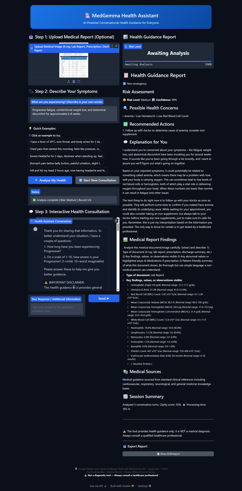
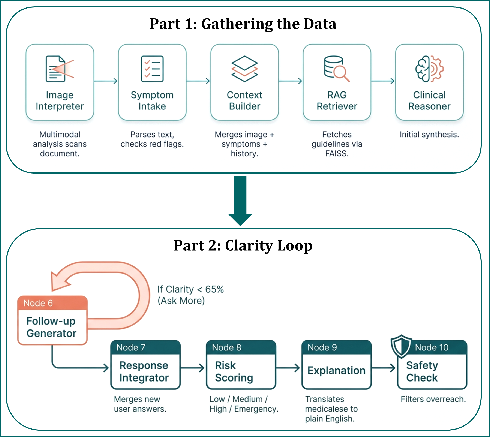

<div align="center">

# 🏥 MedGemma Conversational Health Assistant

**AI-Powered Decision-Support Health Guidance for Non-Expert Patients**

[](https://kaggle.com)
[](https://python.org)
[](https://huggingface.co/google/medgemma-4b-it)
[](https://github.com/langchain-ai/langgraph)
[](https://gradio.app)
[](LICENSE)

<br/>

> ⚠️ **MEDICAL DISCLAIMER**: This tool is **NOT** a diagnostic system. It provides health guidance and decision-support only.  
> Always consult a qualified healthcare professional for medical advice.  


</div>

---

## 🖥️ Demo

<!-- Replace the path below with your actual UI screenshot -->


---

## 🏗️ System Architecture

<!-- Replace the path below with your actual architecture diagram -->


The pipeline is built as a **10-node LangGraph directed acyclic graph**:

```
[Image Upload] ──────────────────────────────────────────────┐
                                                              ▼
[Symptom Text] ──► Node 1: Image Interpreter                 │
                        │                                     │
                        ▼                                     │
                   Node 2: Symptom Interpreter  ◄────────────┘
                        │
                        ▼
                   Node 3: Context Builder
                        │
                        ▼
                   Node 4: RAG Retriever (FAISS)
                        │
                        ▼
                   Node 5: Clinical Reasoner (MedGemma-4B)
                        │
                        ▼
                   Node 6: Follow-up Generator
                        │
                        ▼
                   Node 7: Response Integrator
                        │
                        ▼
                   Node 8: Risk Classifier
                        │
                        ▼
                   Node 9: Explanation Generator
                        │
                        ▼
                   Node 10: Care Suggestion Generator
                        │
                        ▼
                  📋 Final Report (JSON + Markdown)
```

---

## 📌 Overview

Over **4 billion people** worldwide lack adequate healthcare access. Patients cannot understand complex medical reports, panic over symptoms they don't recognize, and delay care due to confusion. This assistant solves that by:

- Accepting **medical images** — X-rays, lab reports, prescriptions, discharge summaries
- Engaging in **intelligent multi-turn conversation** to build a complete clinical picture
- Generating **plain-language, actionable health guidance** — no medical jargon
- Running **100% offline** on consumer hardware — no cloud, no data leaks

---

## ✨ Features

| Feature | Description |
|---|---|
| 🖼️ **Medical Image Understanding** | Analyzes X-rays, lab reports, prescriptions via MedGemma multimodal inference |
| 🩺 **Symptom Parsing** | Categorizes symptoms across 8 clinical domains with emergency red-flag detection |
| 🚨 **Emergency Escalation** | Instantly surfaces emergency alerts for life-threatening symptoms |
| 🔁 **Adaptive Follow-Up** | Asks targeted clarifying questions on duration, severity, history, medications, triggers |
| 📚 **RAG-Enhanced Reasoning** | Retrieves clinical guidelines from a curated FAISS medical knowledge base |
| 🟢🟡🔴 **Risk Stratification** | Classifies risk as Low / Medium / High with confidence scores |
| 🛡️ **Safety Layer** | Filters diagnostic overreach, injects uncertainty, enforces disclaimers |
| 📴 **100% Offline** | Fully local inference — patient data never leaves the device |

---

## 🧱 Tech Stack

| Component | Technology | Version |
|---|---|---|
| Base Model | `google/medgemma-4b-it` | 4B parameters |
| Quantization | BitsAndBytes NF4 + double quant | `>=0.43.0` |
| Agent Framework | LangGraph | `>=0.1.0` |
| RAG / Retrieval | LangChain + FAISS + sentence-transformers | `>=0.2.0` |
| Embeddings | `all-MiniLM-L6-v2` | — |
| UI | Gradio | `>=4.31.0` |
| Hardware Target | Kaggle T4 GPU (16 GB VRAM) | — |

---

## 🚀 Getting Started

### Prerequisites

- Python 3.9+
- CUDA GPU (16 GB VRAM recommended) **or** CPU with 8+ GB RAM
- HuggingFace account with access to [`google/medgemma-4b-it`](https://huggingface.co/google/medgemma-4b-it)

### 1. Clone the Repository

```bash
git clone https://github.com/your-username/medgemma-health-assistant.git
cd medgemma-health-assistant
```

### 2. Install Dependencies

```bash
pip install transformers>=4.40.0 accelerate>=0.27.0 bitsandbytes>=0.43.0 \
            langchain>=0.2.0 langchain-community>=0.2.0 langgraph>=0.1.0 \
            faiss-cpu sentence-transformers gradio>=4.31.0 \
            Pillow torch torchvision huggingface_hub peft einops timm
```

### 3. Authenticate with HuggingFace

```python
from huggingface_hub import login
login(token="YOUR_HF_TOKEN")
```

> On Kaggle, store your token as a secret named `HF_TOKEN`. The notebook retrieves it automatically.

### 4. Run

Open `medgemma_health_assistant_final.ipynb` and run all cells. The Gradio app launches in **Section 18**.

---

## 📖 Usage

1. **(Optional)** Upload a medical image — X-ray, lab report, prescription, or discharge summary
2. **Describe your symptoms** in plain language
3. **Answer follow-up questions** to help the assistant refine its understanding
4. **Receive your report** — risk level, possible concerns, recommended actions, and a plain-language explanation

**Example inputs to try:**
- `"Chest pain this morning, feels like pressure, mild shortness of breath"`
- `"Severe headache for 3 days, dizzy when standing, very thirsty"`
- `"Stomach pain below belly button, painful urination, slight fever since yesterday"`
- `"Hit my head 2 hours ago, now headache and feeling confused"`

---

## 🧠 How It Works

### Multi-Turn Session Flow

```
Round 1 → Full pipeline runs → Clarity < 65%? → Ask follow-up questions
Round 2 → Pipeline re-runs with answers → Clarity < 65%? → Ask more questions
  ...
Round N → Clarity ≥ 65% OR Emergency detected → Generate final report
```

**Clarity threshold**: 65% &nbsp;|&nbsp; **Max follow-up rounds**: 4

### Risk Levels

| Indicator | Level | Meaning |
|---|---|---|
| 🟢 | Low | Self-care likely sufficient; monitor symptoms |
| 🟡 | Medium | Schedule a doctor visit soon |
| 🔴 | High | Seek medical care promptly |
| 🚨 | Emergency | Call emergency services NOW |

---

## 🛡️ Safety Design

- **No diagnosis** — hedged language replaces all diagnostic phrasing automatically
- **Emergency-first** — red-flag symptoms trigger escalation before any other response
- **Mandatory disclaimers** — appended to every single response without exception
- **Content safety** — regex filtering removes hopeless or harmful language
- **Offline by design** — no telemetry, no logging, full patient privacy

---

## 📊 Evaluation

Six built-in test cases validate the pipeline end-to-end:

| ID | Scenario | Expected Risk | Emergency |
|---|---|---|---|
| TC001 | Fever with body ache | Medium | ❌ |
| TC002 | Chest pain + left arm radiation + sweating | High | ✅ |
| TC003 | Dehydration signs | Medium | ❌ |
| TC004 | Possible UTI | Medium | ❌ |
| TC005 | Head injury with confusion | High | ❌ |
| TC006 | Minor finger wound infection | Low | ❌ |

Run the full suite with:
```python
run_evaluation()
```

---

## 📱 Edge Deployment

| Environment | Status | Notes |
|---|---|---|
| Kaggle T4 GPU | ✅ Primary target | 2–5s response time |
| 16 GB RAM Laptop | ✅ Recommended | CPU inference ~10–30s |
| Apple M2 / M3 | ✅ Metal acceleration | Good performance |
| 8 GB RAM Windows/Linux | ⚠️ Possible | 4-bit quantization enables this |
| Android (Termux + llama.cpp) | ⚠️ Experimental | GGUF conversion required |
| iOS (CoreML) | ⚠️ Experimental | Swift integration required |

**Memory footprint:**

```
MedGemma 4-bit model  →  ~2.1 GB VRAM
FAISS medical index   →  ~10  MB RAM
MiniLM embeddings     →  ~80  MB RAM
App overhead          →  ~500 MB RAM
─────────────────────────────────────
Total minimum         →  ~3   GB RAM
```

---

## 🌍 Impact & Roadmap

**Target**: 4+ billion underserved patients globally  
**Use cases**: Rural clinics, home monitoring, elderly care, community health workers  
**Cost**: $0 API cost — fully local inference  
**Privacy**: 100% — no data leaves the device  

**Roadmap:**
- [ ] Multilingual support (Hindi, Swahili, Spanish, Arabic)
- [ ] Voice input/output for low-literacy users
- [ ] Wearable sensor data integration
- [ ] Community health worker dashboard
- [ ] Fine-tuning on local disease prevalence data
- [ ] WhatsApp / SMS bot for feature phones
- [ ] Progressive Web App (PWA)

---

## 📁 Notebook Structure

| Section | Description |
|---|---|
| 1 | Setup & package installation |
| 2 | Imports & GPU detection |
| 3 | HuggingFace authentication |
| 4 | MedGemma model loading (4-bit quantized) |
| 5 | Medical image understanding pipeline |
| 6 | Symptom intake module & emergency detection |
| 7 | RAG pipeline with FAISS medical knowledge base |
| 8 | Conversational follow-up engine |
| 9 | LangGraph state & MedGemma inference helper |
| 9b | LangGraph node definitions (Nodes 1–10) |
| 9c | LangGraph workflow compilation |
| 10 | Decision engine & session manager |
| 11 | Safety layer |
| 12 | Pipeline runner & report formatter |
| 13 | Gradio chat UI |
| 14 | Evaluation suite |
| 15 | Edge deployment notes |
| 16 | Competition writeup |
| 17 | Demo video script |
| 18 | App launch |

---

## 🤝 Acknowledgements

- [**Google MedGemma**](https://huggingface.co/google/medgemma-4b-it) — Medical multimodal language model
- [**LangChain / LangGraph**](https://github.com/langchain-ai/langgraph) — Agentic pipeline framework
- [**FAISS**](https://github.com/facebookresearch/faiss) — Efficient vector similarity search (Meta AI)
- [**Gradio**](https://gradio.app) — ML demo UI (Hugging Face)
- [**BitsAndBytes**](https://github.com/TimDettmers/bitsandbytes) — 4-bit quantization

---

## 📜 License

This project is licensed under the MIT License — see the [LICENSE](LICENSE) file for details.

> Built for the **Google MedGemma Impact Challenge** on Kaggle.  
> For research and demonstration purposes only. Not a certified medical device.

---

<div align="center">

Made with ❤️ to make healthcare guidance accessible to everyone, everywhere.

⭐ **Star this repo if you found it helpful!**

</div>
